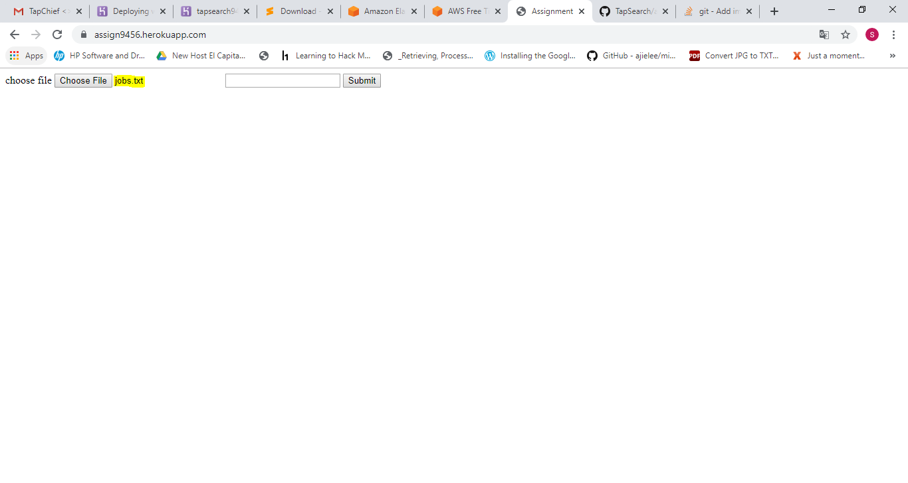

This app(TapSearch) uses ElasticSearch, which takes in multiple paragraphs of text, assigns a unique ID To each paragraph.
For the given word, it lists out the top 10 paragraphs in which the word is present.

How to use TapSearch?

Ans:

step1: goto https://assign9456.herokuapp.com/

step2: click on Choose File button

step3: Choose any text document(This application doesn't work for other file formats)

step4: Write the word in the EditText, which you want to search

Step5: Click on submit button, it will show you the required results on the current web page.

